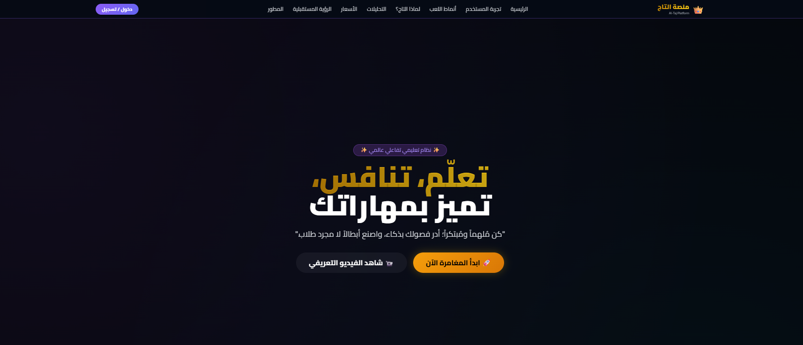
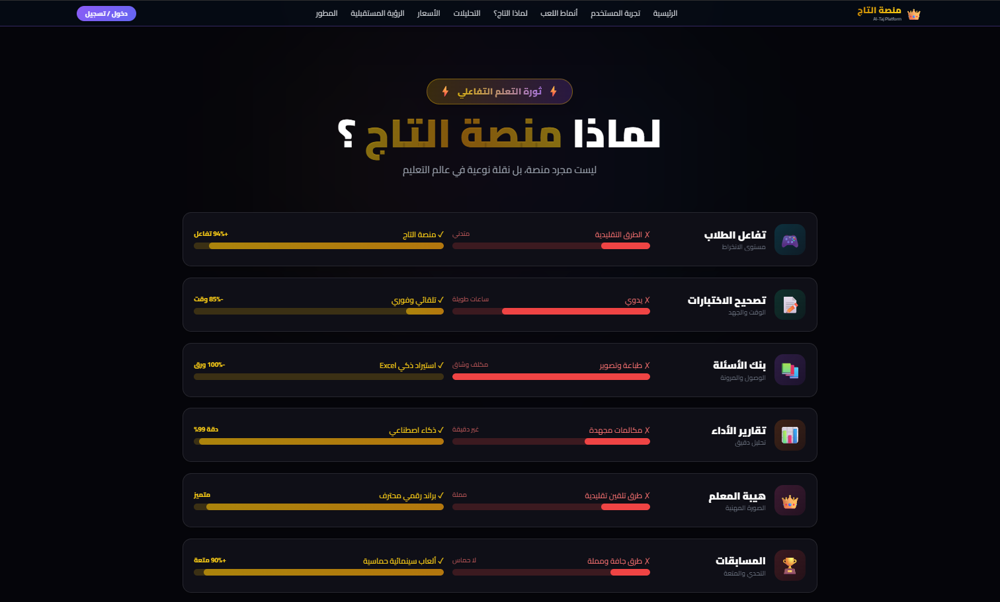

```
تاج
├─ .firebase
│  ├─ hosting..cache
│  └─ hosting.cHVibGlj.cache
├─ firebase.json
└─ public
   ├─ admin-panel.html
   ├─ arena.html
   ├─ assets
   │  ├─ 0first.png
   │  ├─ COBON.png
   │  ├─ developer.png
   │  ├─ first.png
   │  ├─ index.html
   │  ├─ platform.html
   │  ├─ second.png
   │  ├─ student-dashboard.html
   │  ├─ taj-logo.png
   │  ├─ third.png
   │  ├─ wincobon.png
   │  └─ الخريطة.docx
   ├─ coupon.html
   ├─ index.html
   ├─ platform.html
   ├─ sounds
   │  ├─ background-music.mp3
   │  ├─ background.mp3
   │  ├─ correct.mp3
   │  ├─ lobby-music.mp3
   │  ├─ stats-preview.html
   │  ├─ tick.mp3
   │  ├─ win.mp3
   │  └─ wrong.mp3
   ├─ src
   │  ├─ admin
   │  │  ├─ admin.js
   │  │  ├─ adminUI.js
   │  │  ├─ createTeacherHelper.js
   │  │  └─ modern
   │  │     ├─ advanced.js
   │  │     ├─ assistants.js
   │  │     ├─ audit.js
   │  │     ├─ core.js
   │  │     ├─ dashboard.js
   │  │     ├─ messages.js
   │  │     ├─ questions.js
   │  │     ├─ simulate.js
   │  │     ├─ students.js
   │  │     ├─ teachers.js
   │  │     ├─ utils.js
   │  │     └─ violations.js
   │  ├─ arena
   │  │  ├─ components
   │  │  │  ├─ chatMessage.js
   │  │  │  ├─ leaderboardRow.js
   │  │  │  ├─ lobbyModal.js
   │  │  │  ├─ playerCardModal.js
   │  │  │  └─ roomCard.js
   │  │  ├─ core
   │  │  │  ├─ roleDetector.js
   │  │  │  └─ tabManager.js
   │  │  ├─ helpers
   │  │  │  ├─ escapeHtml.js
   │  │  │  └─ showToast.js
   │  │  ├─ index.js
   │  │  ├─ services
   │  │  │  ├─ chatService.js
   │  │  │  ├─ leaderboardService.js
   │  │  │  ├─ profileService.js
   │  │  │  └─ roomsService.js
   │  │  └─ views
   │  │     ├─ globalChatView.js
   │  │     ├─ leaderboardView.js
   │  │     ├─ profileView.js
   │  │     ├─ roomsView.js
   │  │     └─ tournamentsView.js
   │  ├─ config.js
   │  ├─ constants.js
   │  ├─ core
   │  │  ├─ modes
   │  │  │  ├─ BaseMode.js
   │  │  │  ├─ index.js
   │  │  │  ├─ individual
   │  │  │  │  ├─ BetMode.js
   │  │  │  │  ├─ ClassicMode.js
   │  │  │  │  ├─ MarathonMode.js
   │  │  │  │  ├─ MemoryMode.js
   │  │  │  │  ├─ MinedMode.js
   │  │  │  │  ├─ QuizRushMode.js
   │  │  │  │  ├─ SpeedrunMode.js
   │  │  │  │  ├─ SurpriseMode.js
   │  │  │  │  └─ SurvivalMode.js
   │  │  │  ├─ ModeRegistry.js
   │  │  │  └─ team
   │  │  │     ├─ BattleMode.js
   │  │  │     ├─ MinedTeamMode.js
   │  │  │     ├─ PenaltyMode.js
   │  │  │     ├─ RelayMode.js
   │  │  │     ├─ RevengeMode.js
   │  │  │     └─ TrophyMode.js
   │  │  ├─ raceEngine
   │  │  │  ├─ answer.js
   │  │  │  ├─ index.js
   │  │  │  ├─ lifecycle.js
   │  │  │  ├─ turn.js
   │  │  │  ├─ win.js
   │  │  │  └─ withdraw.js
   │  │  ├─ raceEngine.js
   │  │  ├─ raceEvents.js
   │  │  ├─ raceQuestions.js
   │  │  ├─ raceSession.js
   │  │  ├─ raceSettings.js
   │  │  ├─ raceUI
   │  │  │  ├─ betOverlay.js
   │  │  │  ├─ countdown.js
   │  │  │  ├─ index.js
   │  │  │  ├─ questionDisplay.js
   │  │  │  ├─ surpriseChoiceOverlay.js
   │  │  │  ├─ surpriseOverlay.js
   │  │  │  ├─ timer.js
   │  │  │  └─ tracks.js
   │  │  ├─ raceUI.js
   │  │  └─ surpriseCards.js
   │  ├─ data
   │  │  └─ localStorageImpl.js
   │  ├─ db
   │  │  ├─ indexeddb.js
   │  │  └─ localstorage.js
   │  ├─ firebase
   │  │  ├─ auth.js
   │  │  ├─ init.js
   │  │  ├─ presence.js
   │  │  ├─ statsService.js
   │  │  └─ sync.js
   │  ├─ landing
   │  │  ├─ core.js
   │  │  ├─ globals.js
   │  │  ├─ index.js
   │  │  ├─ login-fallback.js
   │  │  ├─ maintenance.js
   │  │  ├─ modals
   │  │  │  └─ login-modal.js
   │  │  ├─ navigation.js
   │  │  ├─ sections
   │  │  │  ├─ analytics.js
   │  │  │  ├─ developer.js
   │  │  │  ├─ experience-tabs.js
   │  │  │  ├─ faq.js
   │  │  │  ├─ future-vision.js
   │  │  │  ├─ hero.js
   │  │  │  ├─ liveStats.js
   │  │  │  ├─ modes.js
   │  │  │  ├─ pricing.js
   │  │  │  ├─ testimonials.js
   │  │  │  └─ why-taj.js
   │  │  └─ utils
   │  │     ├─ charts.js
   │  │     ├─ counters.js
   │  │     ├─ helpers.js
   │  │     └─ maintenance.js
   │  ├─ main
   │  │  ├─ backup.js
   │  │  ├─ event-bindings.js
   │  │  ├─ firestore-listeners.js
   │  │  ├─ grade-helpers.js
   │  │  ├─ index.js
   │  │  ├─ initialization.js
   │  │  ├─ maintenance.js
   │  │  ├─ message-helpers.js
   │  │  ├─ notifications-listener.js
   │  │  ├─ notifications.js
   │  │  ├─ registration.js
   │  │  ├─ reset-session.js
   │  │  ├─ stats-redirect.js
   │  │  └─ student-helpers.js
   │  ├─ main.js
   │  ├─ online
   │  │  ├─ chat
   │  │  │  ├─ chatUtils.js
   │  │  │  ├─ globalChat.js
   │  │  │  └─ roomChat.js
   │  │  ├─ constants
   │  │  │  ├─ defaultGrades.js
   │  │  │  ├─ gameModes.js
   │  │  │  └─ raceConfig.js
   │  │  ├─ core
   │  │  │  ├─ firestoreSync.js
   │  │  │  ├─ hostMigration.js
   │  │  │  ├─ raceState.js
   │  │  │  └─ reconnection.js
   │  │  ├─ globalArenaMenu.js
   │  │  ├─ leaderboard
   │  │  │  ├─ classLeaderboard.js
   │  │  │  ├─ globalLeaderboard.js
   │  │  │  ├─ leaderboardUtils.js
   │  │  │  └─ teacherLeaderboard.js
   │  │  ├─ lobby
   │  │  │  ├─ addStudents.js
   │  │  │  ├─ createRoom.js
   │  │  │  ├─ joinRoom.js
   │  │  │  ├─ leaveRoom.js
   │  │  │  ├─ lobbyUI.js
   │  │  │  ├─ readySystem.js
   │  │  │  ├─ roomCleaner.js
   │  │  │  └─ roomListeners.js
   │  │  ├─ modals
   │  │  │  ├─ addStudentsModal.js
   │  │  │  ├─ createRoomModal.js
   │  │  │  ├─ joinRoomModal.js
   │  │  │  ├─ lobbyModals.js
   │  │  │  └─ tournamentModal.js
   │  │  ├─ modals.js
   │  │  ├─ presence
   │  │  │  ├─ presenceManager.js
   │  │  │  └─ presenceUI.js
   │  │  ├─ race
   │  │  │  ├─ answerHandler.js
   │  │  │  ├─ hostController.js
   │  │  │  ├─ playerController.js
   │  │  │  ├─ questionPublisher.js
   │  │  │  ├─ raceListeners.js
   │  │  │  ├─ sessionManager.js
   │  │  │  ├─ spectatorController.js
   │  │  │  ├─ turnManager.js
   │  │  │  └─ winHandler.js
   │  │  └─ tournament
   │  │     ├─ createMatchRace.js
   │  │     ├─ createTournament.js
   │  │     ├─ joinTournament.js
   │  │     ├─ matchMaker.js
   │  │     ├─ matchManager.js
   │  │     └─ tournamentListeners.js
   │  ├─ questions
   │  │  ├─ bank.js
   │  │  ├─ excel.js
   │  │  └─ lessons.js
   │  ├─ services
   │  │  ├─ archiveService.js
   │  │  ├─ auditLog.js
   │  │  ├─ dataService
   │  │  │  ├─ cache.js
   │  │  │  ├─ grades.js
   │  │  │  ├─ helpers.js
   │  │  │  ├─ index.js
   │  │  │  ├─ questions.js
   │  │  │  ├─ quickRace.js
   │  │  │  ├─ storeFriends.js
   │  │  │  ├─ student.js
   │  │  │  ├─ subscription.js
   │  │  │  ├─ teacherListeners.js
   │  │  │  └─ tournaments.js
   │  │  ├─ dataService.js
   │  │  ├─ maintenanceService.js
   │  │  ├─ presenceCheck.js
   │  │  ├─ roomsService.js
   │  │  ├─ subscription
   │  │  │  ├─ checks.js
   │  │  │  ├─ counters.js
   │  │  │  ├─ index.js
   │  │  │  ├─ plans.js
   │  │  │  └─ teacherData.js
   │  │  ├─ subscriptionGuard.js
   │  │  └─ tournamentTimeoutService.js
   │  ├─ stats
   │  │  ├─ analytics
   │  │  │  ├─ comparison.js
   │  │  │  └─ export.js
   │  │  ├─ components
   │  │  │  ├─ ChartRenderer.js
   │  │  │  ├─ EmptyState.js
   │  │  │  ├─ KPICard.js
   │  │  │  ├─ LessonCard.js
   │  │  │  ├─ StudentCard.js
   │  │  │  └─ TableBuilder.js
   │  │  ├─ core
   │  │  │  ├─ StatsCache.js
   │  │  │  ├─ StatsCalculator.js
   │  │  │  └─ StatsDataService.js
   │  │  ├─ index.js
   │  │  ├─ StatsManager.js
   │  │  ├─ tabs
   │  │  │  ├─ BaseTab.js
   │  │  │  ├─ DashboardTab.js
   │  │  │  ├─ ForecastTab.js
   │  │  │  ├─ InfoTab.js
   │  │  │  ├─ LessonsTab.js
   │  │  │  ├─ LiveTab.js
   │  │  │  ├─ QuestionsTab.js
   │  │  │  ├─ ReportsTab.js
   │  │  │  ├─ StatusTab.js
   │  │  │  └─ StudentsTab.js
   │  │  └─ utils
   │  │     ├─ chartColors.js
   │  │     ├─ filters.js
   │  │     └─ formatters.js
   │  ├─ student
   │  │  ├─ dashboard.js
   │  │  └─ StudentDashboard.js
   │  ├─ students
   │  │  ├─ analysis
   │  │  │  ├─ advancedModal.js
   │  │  │  ├─ helpers.js
   │  │  │  ├─ index.js
   │  │  │  ├─ reportPrint.js
   │  │  │  └─ selectionModals.js
   │  │  ├─ analysis.js
   │  │  ├─ leaderboard.js
   │  │  ├─ studentManager
   │  │  │  ├─ crud.js
   │  │  │  ├─ index.js
   │  │  │  ├─ studentSelect.js
   │  │  │  ├─ teamSetup.js
   │  │  │  └─ teamTemplates.js
   │  │  ├─ studentManager.js
   │  │  └─ studentStats.js
   │  ├─ styles
   │  │  ├─ admin
   │  │  │  ├─ admin-panel.css
   │  │  │  └─ New Text Document.txt
   │  │  ├─ base
   │  │  │  ├─ reset.css
   │  │  │  ├─ typography.css
   │  │  │  ├─ utilities.css
   │  │  │  └─ variables.css
   │  │  ├─ components
   │  │  │  ├─ badges.css
   │  │  │  ├─ buttons.css
   │  │  │  ├─ cards.css
   │  │  │  ├─ forms.css
   │  │  │  ├─ glass.css
   │  │  │  ├─ modal.css
   │  │  │  └─ tables.css
   │  │  ├─ layouts
   │  │  │  ├─ footer.css
   │  │  │  ├─ navbar.css
   │  │  │  └─ sidebar.css
   │  │  ├─ main.css
   │  │  ├─ pages
   │  │  │  ├─ admin.css
   │  │  │  ├─ landing.css
   │  │  │  ├─ platform.css
   │  │  │  ├─ questions-bank.css
   │  │  │  ├─ stats.css
   │  │  │  ├─ student.css
   │  │  │  └─ tournament.css
   │  │  ├─ race
   │  │  │  ├─ bet-overlay.css
   │  │  │  ├─ countdown.css
   │  │  │  ├─ question.css
   │  │  │  ├─ race-interface.css
   │  │  │  ├─ surprise-overlay.css
   │  │  │  ├─ timer.css
   │  │  │  ├─ tracks.css
   │  │  │  └─ withdraw.css
   │  │  ├─ themes
   │  │  │  └─ themes.css
   │  │  └─ utilities
   │  │     ├─ animations.css
   │  │     ├─ print.css
   │  │     └─ responsive.css
   │  ├─ teacher
   │  │  ├─ dashboard.js
   │  │  └─ grades.js
   │  ├─ ui
   │  │  ├─ gameSetupNew.js
   │  │  ├─ modals.js
   │  │  ├─ navigation.js
   │  │  └─ themes.js
   │  ├─ utils
   │  │  ├─ cache.js
   │  │  ├─ crypto.js
   │  │  ├─ device.js
   │  │  ├─ helpers
   │  │  │  ├─ aboutModal.js
   │  │  │  ├─ dom.js
   │  │  │  ├─ image.js
   │  │  │  ├─ loader.js
   │  │  │  ├─ notifications.js
   │  │  │  └─ sound.js
   │  │  └─ polyfills.js
   │  └─ utils.js
   ├─ stats-preview.html
   └─ stats-real.js

```

## Screenshot




